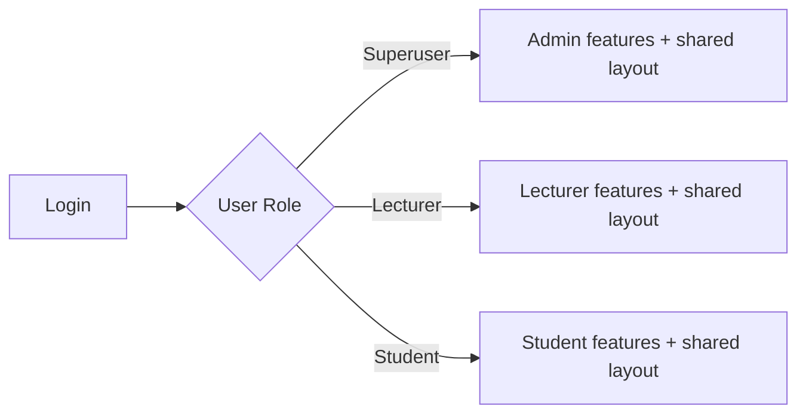
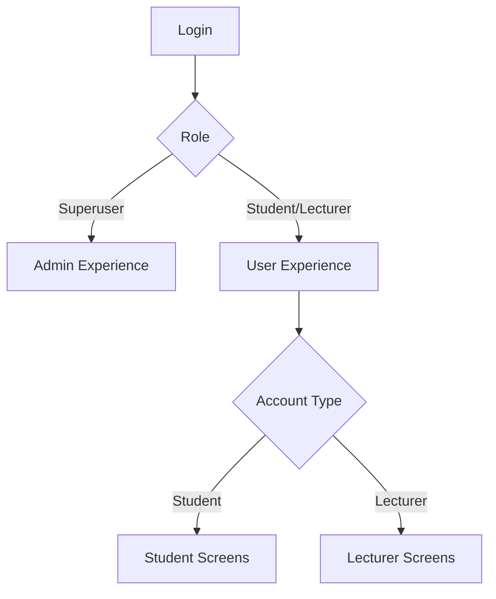
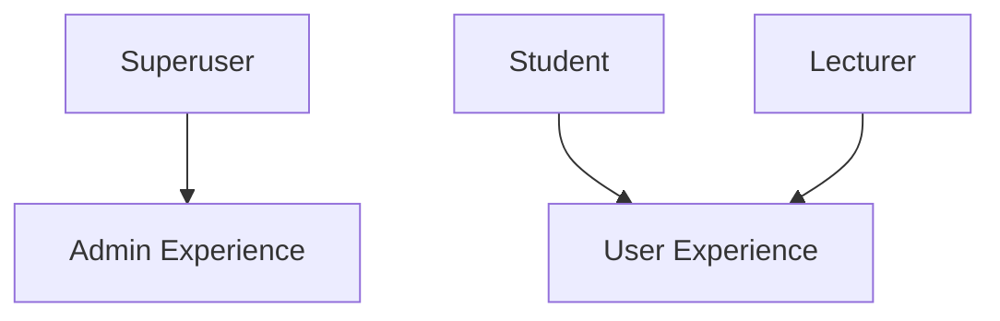
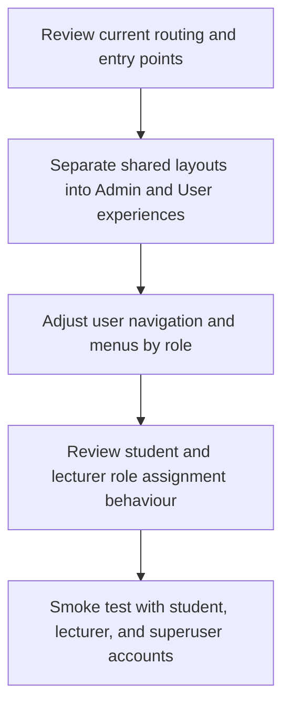

# Design Document: Admin & User Interfaces (Phase 1)

**Author:** Megha Verma  
**Project:** Django LMS  
**Version:** Draft 1  
**Date:** 27 May 2026  
**Reviewer:** Karuna Ma'am

---

## 1. Problem Statement

Right now, **students, lecturers, and admins use a largely shared experience**, which makes it hard to clearly separate “system administration” tasks (creating users, configuring programs, managing the platform) from “day‑to‑day usage” tasks (teachers teaching their classes and students accessing their courses and materials).

We need a **clearer, role-based experience** without rebuilding the entire system.

---

## 2. Goals

- Establish **two clearly separated top-level experiences**:
  - **Admin experience** for **superusers**
  - **User experience** for **students** and **lecturers**
- Keep the user experience cleaner by **showing different menus/screens** within the User experience depending on whether the account is a student or a lecturer
- Review and, if required, enforce mutual exclusivity between student and lecturer roles

---

## 3. Non-goals

- No change to student course registration/sign-up flow
- No change to lecturer course management flow
- No change to course content access rules
- No redesign of existing business logic or permission rules

---

## 3. Current State vs Proposed State

### 3.1 Current State

### 3.2 Proposed State

---

## 4. Side-by-side Summary

| Topic                              | Currently                                                 | Proposed (in Phase 1)                                                     |
| ---------------------------------- | --------------------------------------------------------- | ------------------------------------------------------------------------- |
| **Layout**                         | One shared layout with role-based menus                          | Two experiences: Admin (superuser)_ and User _(student/lecturer)_           |
| **Admin**                          | Admin-only functionality exists but is accessed within the shared application layout | Provide a clearer and more distinct Admin experience while reusing existing admin functionality |
| **Account Roles**                  | `is_student` / `is_lecturer` flags exist                  | Review and clarify student/lecturer role assignment behaviour                                |
| **Student sign-up / registration** | Current behavior                                          | **No change (out of scope)**                                              |
| **Teachers / lecturers**           | Current behavior                                          | **No change (out of scope)**                                              |

---

## 5. Users and Access Rules

- **Superuser**: uses **Admin** experience
- **Student**: uses **User** experience and sees student-specific functionality
- **Lecturer**: uses **User** experience and sees lecturer-specific functionality
- Existing role-based permissions remain unchanged during Phase 1

---

## 6. Phase 1 Workflow

High-level steps:

- Understand the current routing and page flow
- Separate the Admin and User interfaces
- Update menus based on the user's role
- Check how student and lecturer roles are assigned
- Test using student, lecturer, and admin accounts

---

## 7. Success Criteria

- Admins get a separate Admin interface
- Students and lecturers see the correct screens and menu options
- Access restrictions work correctly for each role
- Existing functionality continues to work without issues

---

*This Phase 1 document focuses only on creating separate Admin and User interfaces. Existing functionality and workflows are outside the scope of this phase.*
