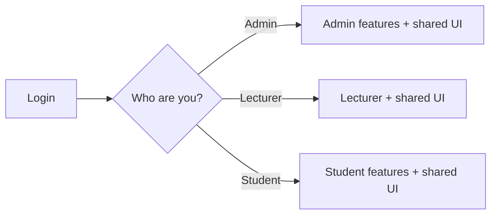
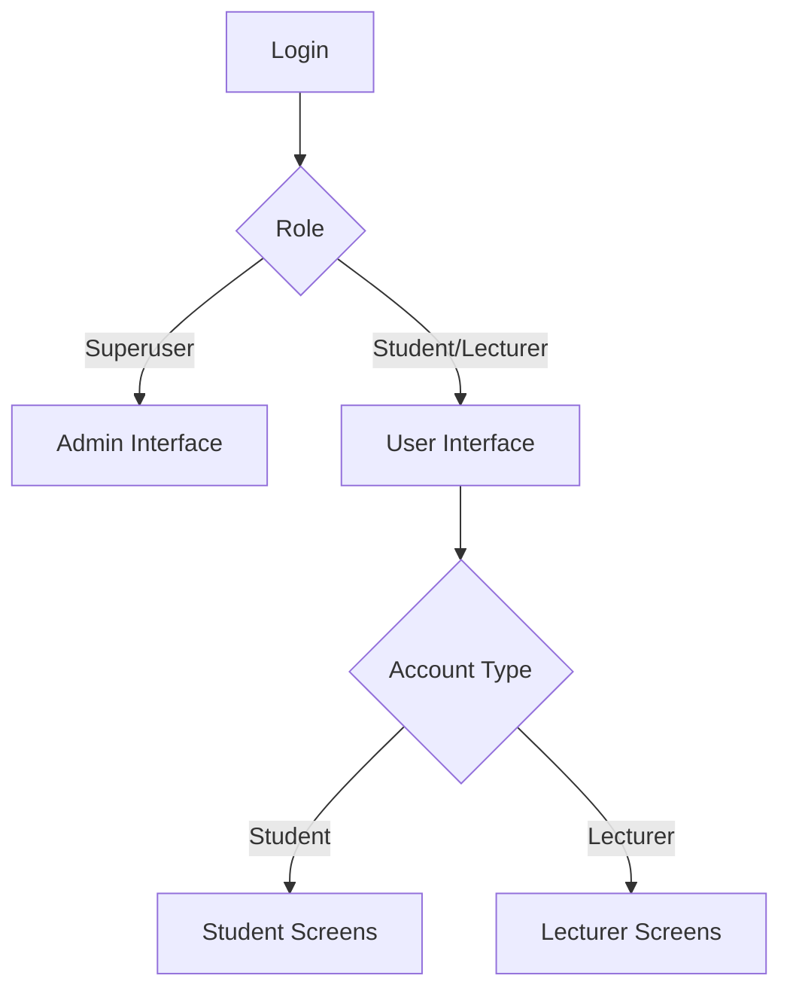
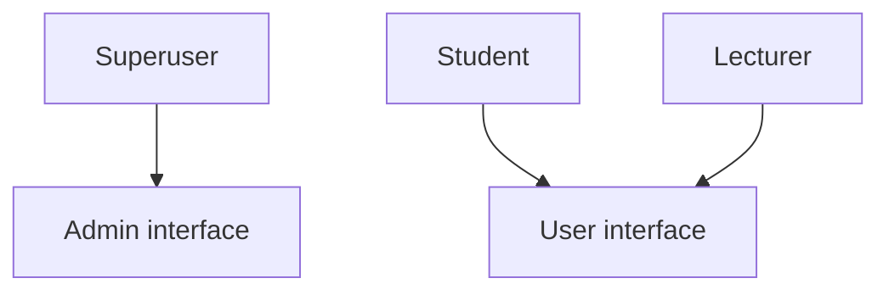
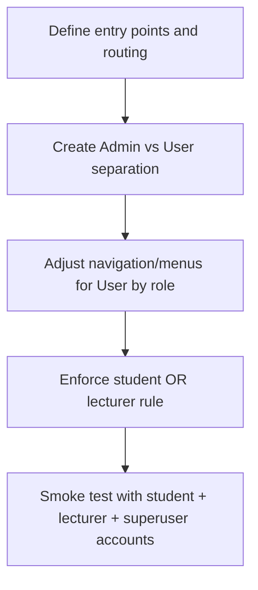

# Design Document: Admin & User Interfaces (Phase 1)

**Author:** Megha Verma  
**Project:** Django LMS  
**Version:** Draft 1  
**Date:** 27 May 2026  
**Reviewer:** Karuna Ma'am

---

## 1. Problem Statement

Right now, **students, teachers, and admins use a largely shared experience**, which makes it hard to clearly separate “system administration” tasks (creating users, configuring programs, managing the platform) from “day‑to‑day usage” tasks (teachers teaching their classes and students accessing their courses and materials).

We need a **clearer, role-based experience** without rebuilding the entire system.

---

## 2. Goals

- Create **two top-level interfaces**:
  - **Admin interface** for **superusers**
  - **User interface** for **students** and **lecturers**
- Keep the user experience cleaner by **showing different menus/screens** inside User depending on whether the account is a student or a lecturer
- Enforce: a user account is **only one thing** — **student OR lecturer**

---

## 3. Non-goals

- No change to student course registration/sign-up flow
- No change to teacher/lecturer course management flow
- No change to course content access rules

---

## 3. Current State vs Proposed State

### 3.1 Current State

### 3.2 Proposed State

---

## 4. Side-by-side Summary

| Topic                              | Currently                                                 | Proposed (in Phase 1)                                                     |
| ---------------------------------- | --------------------------------------------------------- | ------------------------------------------------------------------------- |
| **Layout**                         | One UI for all, role-based menus                          | Two interfaces: Admin _(superuser)_ + User _(student/lecturer)_           |
| **Admin**                          | Mixed into same overall app experience + Django `/admin/` | Admin interface = **Django `/admin/`** for superusers (clear entry point) |
| **Account Roles**                  | `is_student` / `is_lecturer` flags exist                  | Enforce **student OR lecturer** (not both)                                |
| **Student sign-up / registration** | Current behavior                                          | **No change (out of scope)**                                              |
| **Teachers / lecturers**           | Current behavior                                          | **No change (out of scope)**                                              |

---

## 5. Users and Access Rules

- **Superuser**: uses **Admin** interface
- **Student**: uses **User** interface (student screens)
- **Lecturer**: uses **User** interface (lecturer screens)
- A **user** account is **only one role**: student _or_ lecturer

---

## 6. Phase 1 Workflow

High-level steps:

- Define clean entry points: Admin vs User
- Update routing so superusers land in Admin
- Update User navigation to show only relevant items per role
- Enforce “student OR lecturer” for accounts
- Quick testing with demo users

---

## 7. Success Criteria

- Superuser can access **Admin interface** cleanly
- Student and lecturer access **User interface** and see the correct menus
- A user account cannot be both student and lecturer

---

_This Phase 1 doc intentionally does not include changes to student registration or lecturer management, since those are out of scope for now._
